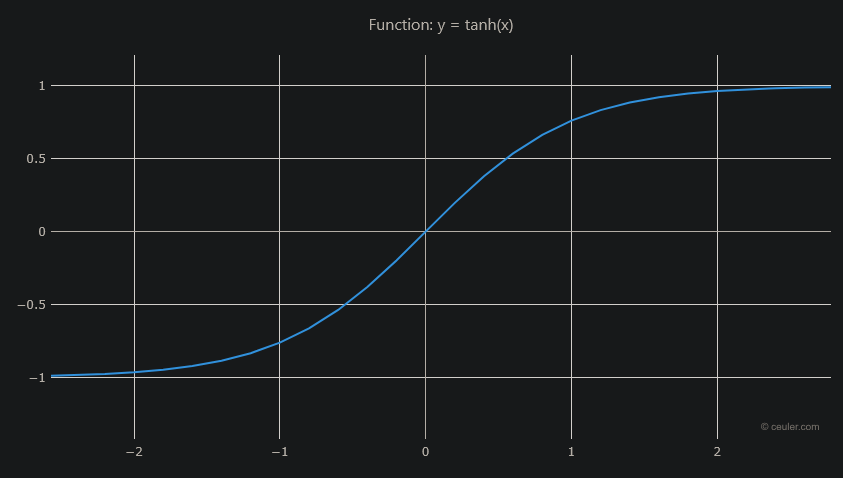

# Sayyit.com
Like Reddit and X, but users are given left/right scores that allow them to be the only moderators.  
  
No hidden algorithms (or hidden elites) determinine what is seen.  
You can choose to see only left, only right, or a mix of both. A true town square.  
  
## Post Scoring
Posts are scored on a left/right scale based upon responses. If a post receives more left responses, it will be scored more left. If it receives more right responses, it will be scored more right.  
The equation for a post's score is:  
>  S<sub>n</sub> = **tanh**(k*m<sub>n</sub>)  * 100%
  
S<sub>n</sub> -> the score of a post after *n* responses, as a percentage.  
k -> a constant that determines how quickly the score changes with responses. **Currently set to 0.1**, but this can be adjusted to make the scoring more or less sensitive to responses. A higher k value will make the score change more quickly with each response.

When S<sub>n</sub> is negative the absolute value is displayed as a left score.  

The tanh function is used to ensure that the score remains between -1 and 1, where -1 represents a completely left post and 1 represents a completely right post.  
tanh ensures the score approaches -1 or 1 asymptotically, meaning that as more responses are received, the score will get closer and closer to -1 or 1, but will never actually reach those values. 
This allows for a more nuanced scoring system where posts can be strongly left or right without being completely one-sided.  

  
m<sub>n</sub> -> the mean score of the post after *n* replies. The mean score is calculated as:  
>  m<sub>n</sub> = (L + R) / (|L| + R)
\(m_n = \frac{1}{n} \sum_{i=1}^n r_i\)
```math
m_n = \frac{1}{n} \sum_{i=1}^n r_i
```
$$
m_n = \frac{1}{n} \sum_{i=1}^n r_i
$$
<p>
  m<sub>n</sub> = (1 / n) &sum;<sub>i=1</sub><sup>n</sup> r<sub>i</sub>
</p>
Where:  
 L -> the sum of all left responses. Each response adds -1.  
 R -> the number of all right responses. Each response adds +1.  

 The effect is a score that looks like the following graph, where the x-axis is the mean score of the post and the y-axis is the final score of the post.  
  

## User Scoring  
Users recieve a left/right score based on the scores of their posts. 
This allows users to be ranked on a left/right scale based on the content they post:  
>  S<sub>u</sub> = C<sub>u</sub> ​⋅ sign(m<sub>n</sub>) 

Where:  
S<sub>u</sub> -> User Score. This is a combination of a users posts scores and a confidence value based on the number and direction of replies to their posts.
> C<sub>u</sub> = (1−e<sup>-λn</sup>)∣m<sub>n</sub>​|  

C<sub>u</sub> -> Confidence score. This is a value between 0 and 1 that represents how confident we are in the user's score based on the number of posts they have made and the direction of those posts.  

λ -> a constant that determines how quickly the confidence score increases with the number of posts. 
**Currently set to 0.1**.
  
 **This means a user can switch between being a "lefty" and a "righty"** based on replies to content they post, and their score will reflect the overall lean of their contributions to the platform.